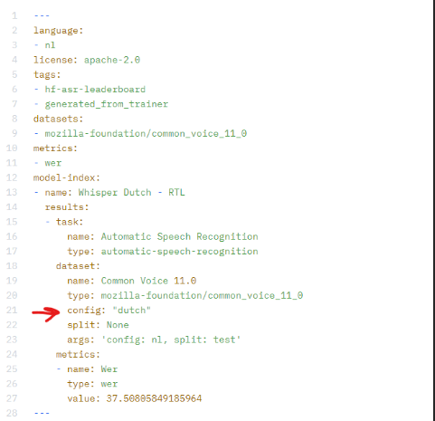

# Documentation finetuning Whisper small model – RTL Project AAI 

# Whisper 
OpenAI has recently released a new speech recognition model called Whisper. Unlike DALLE-2 and GPT-3, Whisper is a free and open-source model. Whisper is an automatic speech recognition model trained on 680,000 hours of multilingual data collected from the web. As per OpenAI, this model is robust to accents, background noise and technical language. In addition, it supports 99 different languages’ transcription and translation from those languages into English. 

During this project, we were aiming for the large-v2 model, but because of several issues such as limited computing power, we had to work with the small model.  

# Datasets 
During our project we have used two datasets: common voice for training our finetuned model and jasmin to evaluate and test our finetuned model.  

## Common Voice 
The Common Voice dataset is an open-source initiative by Mozilla, aimed at creating a publicly available dataset for training and developing speech recognition technologies. It was created to address the lack of diverse and openly accessible voice data, which can be a significant barrier in the development of speech recognition systems. 

The Common Voice project encourages volunteers from around the world to contribute their voice by recording and submitting audio samples. Participants are asked to read aloud a set of prompted sentences, which helps create a diverse collection of voices, accents, languages, and speech patterns. 

The dataset is designed to be multilingual and includes contributions in various languages. It aims to cover a wide range of accents, dialects, and speaking styles to improve the accuracy and inclusivity of speech recognition systems. By allowing individuals to freely contribute their voice, the project enables the collection of data from underrepresented populations and regions. 

## Jasmin 
The baseline of the subgroups in the modelcard are from the Jasmin research, which are the native children between 7 and 11, native children between 12 and 16, non-native children between 7 and 16, non-native adults and native adults above 65. Almost 100 hours of spoken text are collected to create a baseline.

# Finetune process 
For the entire finetune process we have used a blog: https://huggingface.co/blog/fine-tune-whisper 

This blog contains a step-by-step tutorial for finetuning whisper. To see our finetuned code, you can visit the following link: https://huggingface.co/hannatoenbreker/whisper-dutch-small/tree/main 

## Finetuning 
The process of finetuning a model involves retraining the model on a new data set, using the existing model parameters as a starting point. By doing this, we can effectively "teach" the model to perform better on our specific task, while still benefiting from the pre-trained "knowledge" of the model. 
 
## Pipeline: 
- Dataset loading and preprocessing: The code starts by loading the Common Voice dataset, in Dutch language. It then selects a subset of the data for training and testing. Unnecessary columns are removed to simplify the dataset. The dataset is then processed to generate input features using the WhisperFeatureExtractor and the labels using the WhisperTokenizer. 

- Data Collator: The DataCollatorSpeechSeq2SeqWithPadding class is used for padding the input features and the labels during training. This is necessary because batches of sequences in NLP tasks often have variable lengths, and we need to pad them to the same length to enable batch processing. 

- Model Initialization: The WhisperForConditionalGeneration model is loaded from a pre-trained model. This model is used for the task of conditional generation, where the task is to generate a sequence of output tokens given a sequence of input tokens. 

- Training Arguments: The Seq2SeqTrainingArguments object is used to specify the various parameters for training the model. Here, they define things like the output directory, batch size, learning rate, max steps, evaluation strategy, etc. 

- Trainer Initialization: The Seq2SeqTrainer is initialized with the previously defined training arguments, the model, the datasets, the data collator, and a method to compute metrics. 

- Training: The trainer.train() method is called to start training the model. 

- Pushing to the Hugging Face Model Hub: After training, the model is pushed to the Hugging Face model hub for others to use. The trainer.push_to_hub() method is called with some metadata about the model. 

## Adding the tokenizer 
It is important to note that the tutorial does not include code that pushes the tokenizer to Huggingface, which results in a tokenizer error. That’s why it is important to include this line of code after defining the training arguments:

```
processor.save_pretrained(training_args.output_dir)
```

## Pushing config to git 
After finetuning the model, the code tries to push the model to huggingface. During this process an error can occur: ‘Error: "model-index[0].results[0].dataset.config" must be a string’. This can be solved by manually editing the README.md of the model. At the top of the file, there is a config that can be edited. You should edit the value of the key named “config” which can be found under model-index -> results -> dataset. The given value should be a valid string. 



We believe the core of the issue is in the kwargs argument (see picture below). We did not have time to try solving the issue from our code, but we would suggest trying a different dataset argument to solve the error beforehand.  


## Connect Huggingface to Visual studio code
https://huggingface.co/docs/huggingface_hub/installation 

https://huggingface.co/docs/hub/security-tokens 

# Evaluation
To evaluate the model, you can use the shell script found here: /home2/rai_asr/eval/eval_whisper_rtl.sh. This script uses eval.py to evaluate the model on the Jasmin dataset. Eval.py can be found here: /home2/rai_asr/eval/eval.py. To change the model that you want to evaluate, you need to open eval.py and find the class “rtl_whisper_asr_model”. This class has the init method and a prediction method, which is used to evaluate an audio file with the model. To change the model that is used in this process you need to change the model in the pipeline to the model that you want to evaluate. The pipeline can be found in the predict method. 

## Evaluation pipeline 

The pipeline, which can be found in the predict method of the rtl_whisper_asr_model class, has a few parameters.  

**Chunck_length_s** is an important one because if you don’t use this parameter, the model will only transcribe the first 30 seconds of the audio file instead of the whole audio file. The value of this parameter can be changed and will have a (slight) impact on the WER, so we advise experimenting with it. When working with audio data, it is common to divide the waveform into smaller segments or chunks to process them efficiently. These chunks can be of fixed length or variable length, depending on the requirements of the task. 

**Device** defines the GPU that is used for the transcribing. In this case, we use GPU 0. This was because other students were using GPU 1. 

**Generate_kwargs** if you do not add this parameter, the pipeline will translate the transcribed text to english. Therefore, it is important to specify the language and task of the pipeline.  
 
# Technical aspects 
## Server 
For the sake of this tutorial, we will assume that you want to connect to the ml.hihva.nl server. There are other servers, like the Jupyter server, but these don't have enough processing power or the necessary access rights to finetune whisper models.  

### Connecting
To connect with the server, you first need an account (username and password). You also need to be connected to the HvA wifi. If you are not present at the HvA you can use the VPN via Ivanti. Then, you can connect via your terminal by typing "ssh username@ml.hihva.nl". After executing that command, you will get a prompt for your password. 

### Note 
It's important to note that the server is only powerful enough to finetune the small Whisper model. 

# Recommendation 
In the tutorial of HuggingFace we followed, the Common Voice dataset is being used. So we decided to experiment with it. This dataset is based in 2017, which is already 6 years ago. There are some updates every year, which makes the resource trustful. For future research another dataset might be needed to compare the results of both datasets. 

Remarkable is that our finetuned model with 1000 iterations has better WER results than with 4000 iterations. This can be a sign of overfitting the model with 4000 iterations, so this is also good to keep in mind. 

After finetuning the small model, the transcribed text still contains hallucinations which we couldn’t find out during the project. Hallucinations are repeated words in a sentence which makes the Word Error Rate (WER) higher. We don’t know why our model hallucinates, but we may have some suggestions that you could try:  

Experimenting with different training arguments (eval_steps, iterations) or pipeline arguments (chunck_length, stride_length) 

It could be a lack of computing power that causes the hallucination.  

The model could be overfitting because of too many data or too many iterations 

We tried to use a small subset of the common voice dataset to finetune the model, but that didn’t help with preventing hallucinations. 

# Useful links 

## Our pages 
https://huggingface.co/spaces/hannatoenbreker/whisper-dutch-small-gradio 

https://huggingface.co/hannatoenbreker/whisper-dutch-small 

## Blog finetuning 
https://huggingface.co/blog/fine-tune-whisper 

## Backgroundinformation about Whisper 
https://openai.com/research/whisper 

https://github.com/openai/whisper 

## Huggingface token + installation 
https://huggingface.co/docs/huggingface_hub/installation 

https://huggingface.co/docs/hub/security-tokens 

 

 

 

 

 